<div align="center">
  
</div>

# SideKick AI - Hierarchical Multi-Agent Productivity Assistant

🏆 **Built for AWS AI Agent Global Hackathon 2025**

[](https://aws.amazon.com/bedrock/)
[](https://aws.amazon.com/bedrock/agents/)
[](https://aws.amazon.com/fargate/)
[](https://www.python.org/)
[](https://chainlit.io/)

> ✅ **Status**: Production-Ready Hackathon Submission

An AI orchestrator that coordinates specialized agents to maximize your workday. Built with Amazon Bedrock AgentCore, this hierarchical multi-agent system demonstrates innovative AWS service integration, intelligent query construction, and production-grade safety enforcement.

**🎬 [Watch Demo Video](#)** | **🚀 [Live Demo](#)** | **📖 [Hackathon Details](HACKATHON.md)** | **☁️ [AWS Services](AWS_SERVICES.md)**

## Overview

SideKick AI is a **hierarchical multi-agent productivity assistant** that orchestrates 7 specialized AI agents to help busy professionals maximize their workday. Unlike traditional single-agent assistants, SideKick uses Amazon Bedrock AgentCore to coordinate parallel agent execution, enabling sophisticated workflows like daily briefings that aggregate information from calendars, emails, JIRA, incidents, and AWS infrastructure simultaneously.

### 🌟 Key Innovations

1. **Hierarchical Multi-Agent Architecture** - Orchestrator + 7 specialized workers using Agents-as-Tools pattern
2. **Amazon Bedrock AgentCore Integration** - Containerized agent runtime with production-grade deployment
3. **Intelligent DynamoDB Query Construction** - Natural language time parsing ("Q3 2025" → precise date ranges)
4. **Read-Only AWS Safety Enforcement** - Strictly enforced for security (analyze but never modify)
5. **Multi-Source Report Generation** - Combines Knowledge Bases + DynamoDB + AWS data
6. **RAG-Powered Knowledge Retrieval** - Bedrock Knowledge Bases with semantic search
7. **Secure OAuth Integration** - AgentCore Identity for token storage

**🎯 [View Complete Capabilities Guide →](CAPABILITIES.md)** | **🏆 [Hackathon Submission Details →](HACKATHON.md)**

### Core Capabilities Summary

#### 📅 Calendar & Schedule Management
- View today's meetings and appointments
- Get detailed meeting information
- Set meeting agendas
- Detect scheduling conflicts

#### 📧 Email Intelligence
- Recent and urgent email detection
- AI-powered action item extraction
- Natural language deadline parsing
- Priority determination from context

#### 🎫 JIRA Project Management (Read & Write)
- View all issues and assigned tasks
- Search and filter by status/priority
- Update issues, add comments, transition workflows
- OAuth authentication with Atlassian

#### 📚 Confluence Documentation
- Retrieve specific pages by ID
- Search documentation with CQL
- Link documentation to JIRA issues

#### 🚨 Incident Management
- Monitor open and critical incidents
- View incident details and timelines
- Search incidents by keyword
- Correlate with email notifications

#### ☁️ AWS Infrastructure Monitoring (Read-Only)
- List EC2 instances, S3 buckets, Lambda functions
- Query DynamoDB tables intelligently
- Monitor CloudWatch alarms
- Estimate AWS costs and billing
- **Strictly read-only for safety**

#### 🔍 DynamoDB Query Intelligence
- Natural language time parsing (Q3 2025, third quarter, etc.)
- Automatic schema discovery
- Optimal query construction
- Adaptive aggregations

#### 📖 Knowledge Base & RAG
- Semantic search across documents
- Retrieve templates and guidelines
- Budget analysis and comparisons
- Source citations and relevance scoring

#### 📊 Report Generation & Analytics
- Generate comprehensive sales reports
- Combine templates with live data
- Calculate metrics and aggregations
- Professional formatting with insights

#### 🛡️ Security & Guardrails
- Bedrock Guardrails for content filtering
- OAuth 2.0 secure authentication
- Read-only AWS enforcement
- PII protection and audit logging

## Architecture

### Agent Hierarchy

The system uses a **hierarchical multi-agent architecture** with the Orchestrator coordinating specialized Worker agents:

```plantuml
@startuml Agent Architecture
!define RECTANGLE class

skinparam backgroundColor #FEFEFE
skinparam componentStyle rectangle

' User Layer
actor User as user

' Frontend Layer
component "Chainlit UI\n(Conversational Interface)" as chainlit #LightBlue

' Orchestrator Layer
component "Orchestrator Agent\n(Coordination & Routing)" as orchestrator #Orange {
  [calendar_tool]
  [email_tool]
  [jira_tool]
  [incident_tool]
  [aws_tool]
  [knowledge_base_tool]
  [report_tool]
}

' Worker Agent Layer
package "Worker Agents" #LightGreen {
  component "Calendar Worker" as calendar {
    [get_todays_calendar_events]
    [get_event_details]
    [set_event_agenda]
    [find_calendar_event_semantic]
  }
  
  component "Email Worker" as email {
    [get_recent_emails]
    [get_urgent_emails]
    [get_email_actions]
  }
  
  component "Jira Worker" as jira {
    [get_all_jira_issues]
    [get_assigned_jira_issues]
    [search_jira_issues]
    [search_jira_issues_semantic]
    [get_jira_issue_details]
  }
  
  component "Incident Worker" as incident {
    [get_all_incidents]
    [get_critical_incidents]
    [search_incident]
    [search_incident_semantic]
  }
  
  component "AWS Worker\n(Read-Only)" as aws {
    [list_s3_buckets]
    [list_ec2_instances]
    [list_lambda_functions]
    [query_dynamodb]
  }
  
  component "Knowledge Base Worker" as kb {
    [retrieve_documents]
    [search_knowledge_base]
  }
  
  component "Report Worker" as report {
    [get_report_template]
    [fetch_sales_data]
    [generate_report]
  }
}

' Support Agent Layer
package "Support Agents" #LightYellow {
  component "DynamoDB Query Builder" as querybuilder {
    [describe_dynamodb_table]
    [parse_time_expression]
    [build_query_spec]
  }
}

' Adapter/Tool Layer
package "Adapters & External Services" #LightGray {
  database "DynamoDB\n(Static Data)" as dynamodb
  storage "S3\n(Templates & Docs)" as s3
  cloud "Bedrock\nKnowledge Base" as bedrock_kb
  cloud "Bedrock\nEmbeddings\n(Titan)" as bedrock_embed
  component "Calendar Adapter\n(Static Data)" as cal_adapter
  component "Email Adapter\n(Static Data)" as email_adapter
  component "Jira Adapter\n(Auto-detect)" as jira_adapter
  component "Incident Adapter\n(Static Data)" as incident_adapter
}

' User interactions
user --> chainlit : "Help me plan my day"
chainlit --> orchestrator : Query routing

' Orchestrator to Workers (Agents-as-Tools pattern)
orchestrator --> calendar : Delegates calendar queries
orchestrator --> email : Delegates email queries
orchestrator --> jira : Delegates Jira queries
orchestrator --> incident : Delegates incident queries
orchestrator --> aws : Delegates AWS queries (read-only)
orchestrator --> kb : Delegates KB queries
orchestrator --> report : Delegates report generation

' Report Worker dependencies
report ..> kb : Uses for templates
report ..> aws : Uses for data
report ..> querybuilder : Uses for query construction

' Query Builder integration
querybuilder --> aws : Provides optimized queries

' Workers to Adapters/Services
calendar --> cal_adapter
email --> email_adapter
jira --> jira_adapter
incident --> incident_adapter
aws --> dynamodb
aws --> s3
kb --> bedrock_kb
kb --> s3

' Notes
note right of orchestrator
  Routes user queries to
  appropriate worker agents
  using Agents-as-Tools pattern
end note

note right of report
  Composes multiple workers:
  - KB for templates
  - AWS for data
  - Query Builder for optimization
end note

note bottom of aws
  READ-ONLY operations only
  No mutations allowed
end note

@enduml
```



**Agents-as-Tools Pattern** (StrandsAgents 1.10.0+):
- **Orchestrator Agent** coordinates 7 specialized Worker agents
- Each **Worker Agent** is wrapped as a callable tool
- Clean hierarchical delegation with semantic routing
- **Support Agents** (Query Builder) enhance worker capabilities

**Tech Stack:**
- **Frontend**: Chainlit 2.8.1 (conversational UI)
- **Agents**: StrandsAgents 1.10.0
- **Model**: Amazon Bedrock Nova Pro v1:0 (Orchestrator), Nova Lite v1:0 (Workers)
- **RAG**: Amazon Bedrock Knowledge Bases
- **Integration**: Atlassian Remote MCP Server
- **Infrastructure**: AWS CDK v2, Bedrock AgentCore, ECR
- **Region**: eu-central-1 (hard requirement)

## Project Structure

```
daily-planner/
├── app/                          # Chainlit application
│   ├── app.py                    # Main handlers
│   ├── health.py                 # Health check
│   └── settings.py               # Configuration
├── agents/                       # Agent implementations
│   ├── orchestrator.py          # Main orchestrator
│   ├── worker_calendar.py       # Calendar worker
│   └── worker_kb.py             # Knowledge Base worker
├── tools/                        # Tool adapters
│   ├── schemas.py               # Data models
│   ├── calendar_adapter.py      # Calendar client
│   └── bedrock_kb_client.py     # KB wrapper
├── infra/                        # AWS CDK stacks
│   ├── app.py                   # CDK entry point
│   ├── stacks/
│   │   ├── knowledge_base_stack.py
│   │   ├── app_config_stack.py
│   │   └── agent_runtime_stack.py
│   └── cdk.json
├── configs/                      # Configuration
│   ├── agentcore.yaml           # Agent config
│   └── calendar_data.json       # Sample data
├── tests/                        # Unit tests
│   ├── test_planner.py
│   ├── test_kb_retrieve.py
│   └── test_jira_adapter.py
├── docs/                         # Documentation
│   ├── ARCH.md                  # Architecture
│   ├── DEPLOY.md                # Deployment guide
│   └── RUNBOOK.md               # Dev guide
├── .env.sample                   # Environment template
├── Dockerfile                    # Container image
├── requirements.txt              # Dependencies
└── README.md                     # This file
```

## 📚 Capability Documentation

Explore what SideKick can do for you:

| Document | Best For | Description |
|----------|----------|-------------|
| **[📋 Complete Capabilities Guide](CAPABILITIES.md)** | Deep dive | Comprehensive documentation with detailed examples for all 11 capability categories |
| **[⚡ Quick Reference](QUICK_REFERENCE.md)** | Daily use | Fast reference for common commands, troubleshooting, and pro tips |
| **[📊 Capabilities Summary](CAPABILITIES_SUMMARY.md)** | Executives | Business value proposition and executive overview |
| **[🎯 Capability Matrix](CAPABILITY_MATRIX.md)** | Technical teams | Visual matrices for features, security, performance, and scalability |

## Quick Start

### Local Development

```bash
# Setup
python3.11 -m venv venv
source venv/bin/activate
pip install -r requirements.txt

# Configure
cp .env.sample .env
# Edit .env with your AWS credentials

# Generate authentication secret (optional)
python scripts/generate_auth_secret.py

# Verify auth setup (if enabled)
python scripts/test_auth_setup.py

# Run
cd app
chainlit run app.py
```

Access at **http://localhost:8000**

#### 🎓 Demo Credentials (Hackathon Judges)

For easy evaluation, we've configured simple authentication. If you see a login screen, use:

- **Username**: `******`
- **Password**: `**********`

These credentials provide full access to all features for demonstration purposes.

**Note**: Authentication is optional for local development. If you don't see a login screen, the app is running in open mode - just start chatting!

📖 Detailed guide: [docs/RUNBOOK.md](docs/RUNBOOK.md)

### AWS Deployment (AgentCore)

```bash
# Full deployment with container build
./scripts/deploy-agentcore.sh

# Or step by step
./scripts/deploy-agentcore.sh infrastructure  # Deploy CDK stacks only
./scripts/deploy-agentcore.sh container       # Build and push container only
```

📖 Detailed guide: [docs/DEPLOY.md](docs/DEPLOY.md)

### HTTPS/SSL Configuration (Production)

For production deployments and OAuth integration, configure HTTPS with AWS Certificate Manager:

```bash
# 1. Request ACM certificate (interactive helper)
./scripts/request_acm_certificate.sh

# 2. Add certificate ARN to .env
ACM_CERTIFICATE_ARN=arn:aws:acm:region:account:certificate/cert-id
DOMAIN_NAME=sidekick-ai.example.com  # Optional

# 3. Deploy with HTTPS enabled
cd infra
cdk deploy sidekick-ecs-dev

# 4. Update OAuth redirect URI to HTTPS
ATLASSIAN_OAUTH_REDIRECT_URI=https://sidekick-ai.example.com/oauth/callback
```

**Features**:
- ✅ HTTPS on port 443 with valid SSL certificate
- ✅ Automatic HTTP to HTTPS redirect (301)
- ✅ Free ACM certificates with auto-renewal
- ✅ Production-ready security configuration

📖 **Guides**:
- **Namecheap Domain**: [NAMECHEAP_QUICKSTART.md](NAMECHEAP_QUICKSTART.md) ⭐ Start here!
- **Complete Setup**: [docs/HTTPS_SSL_SETUP.md](docs/HTTPS_SSL_SETUP.md)
- **Namecheap Detailed**: [docs/NAMECHEAP_HTTPS_SETUP.md](docs/NAMECHEAP_HTTPS_SETUP.md)

## Usage Examples

### Plan Your Day

```
User: "Help me plan my day"

Agent:
📅 Today's Calendar:
- 9:00 AM: Team Standup (30min)
- 2:00 PM: Client Demo (1hr)
- 3:30 PM: Code Review (1hr)

📋 Active Jira Tasks:
- PROJ-123: Implement feature X (In Progress)
- PROJ-124: Fix bug Y (To Do)
- PROJ-125: Update documentation (In Progress)

Which task would you like help with?
```

### Get Task Breakdown

```
User: "Help me with PROJ-123"

Agent:
🎯 Task: Implement feature X

Based on the issue details and knowledge base, here's your plan:

Step 1: Review the feature requirements document (15min)
Step 2: Design the API contract and data models (30min)
Step 3: Implement core business logic (2hr)
Step 4: Write unit tests (1hr)
Step 5: Update API documentation (30min)
Step 6: Create pull request and request review (15min)

Would you like me to help with any specific step?
```

## Features

### ✅ Implemented

- [x] Chainlit conversational UI with streaming
- [x] Orchestrator agent with Agents-as-Tools pattern
- [x] Calendar Worker (static data for demo)
- [x] Jira/MCP Worker (automatic API detection with OAuth)
- [x] Knowledge Base Worker (Bedrock KB Retrieve API)
- [x] Tool adapters for external services
- [x] AWS CDK infrastructure (3 stacks)
- [x] **Bedrock AgentCore runtime** (replaces ECS/Fargate)
- [x] **ECR repository with lifecycle management**
- [x] **Automated deployment scripts**
- [x] **Automatic data source detection** (real APIs when credentials configured)
- [x] Health check endpoints
- [x] Unit tests for core logic
- [x] Complete documentation (ARCH, DEPLOY, RUNBOOK)
- [x] Docker containerization
- [x] Configuration management (env vars, secrets)

### 🚀 Future Enhancements

- [ ] Google Calendar OAuth integration
- [ ] OpenSearch Serverless for production KB
- [ ] Redis session store
- [ ] Full streaming from StrandsAgents
- [ ] CloudWatch dashboards
- [ ] Multi-tenancy support
- [ ] CI/CD pipeline

## Documentation

| Document | Description |
|----------|-------------|
| **[CAPABILITIES.md](CAPABILITIES.md)** | **📋 Complete capabilities guide with examples** |
| [ARCH.md](docs/ARCH.md) | Architecture, design patterns, data flow |
| [DEPLOY.md](docs/DEPLOY.md) | AWS deployment, troubleshooting, production |
| [RUNBOOK.md](docs/RUNBOOK.md) | Local development, testing, debugging |
| [AGENTCORE_MIGRATION.md](docs/AGENTCORE_MIGRATION.md) | **AgentCore migration guide and benefits** |
| [atlassian-oauth-setup.md](docs/atlassian-oauth-setup.md) | **Atlassian OAuth 2.0 setup and configuration** |
| [oauth-quick-reference.md](docs/oauth-quick-reference.md) | **OAuth quick reference and cheat sheet** |
| [error-handling-guide.md](docs/error-handling-guide.md) | **OAuth error handling and troubleshooting** |
| [oauth-integration-guide.md](docs/oauth-integration-guide.md) | OAuth integration technical details |

## Tech Stack

| Component | Technology | Version |
|-----------|-----------|---------|
| Language | Python | 3.11+ |
| Agent Framework | StrandsAgents | 1.10.0+ |
| Frontend | Chainlit | 2.8.1+ |
| Model | Amazon Bedrock | Nova Pro v1:0 |
| RAG | Bedrock Knowledge Bases | Latest |
| Integration | MCP | Latest |
| Infrastructure | AWS CDK | 2.214.0+ |
| Container Runtime | **Bedrock AgentCore** | Latest |

## Configuration

### Environment Variables

Key configuration in `.env`:

```bash
AWS_REGION=eu-central-1
KNOWLEDGE_BASE_ID=<your-kb-id>
BEDROCK_MODEL_ID=eu.amazon.nova-pro-v1:0
```

### Automatic Data Source Detection

The application automatically detects which data sources to use based on available credentials:

- **JIRA & Confluence**: Uses real Atlassian APIs when OAuth credentials are configured, otherwise uses static demo data
- **Calendar**: Uses static demo data (Google Calendar OAuth can be added in future)
- **Email**: Uses static demo data with optional Bedrock-powered summarization
- **Incidents**: Uses static demo data
- **Knowledge Base**: Uses real Bedrock Knowledge Base when `KNOWLEDGE_BASE_ID` is configured

No mode flags needed - the system intelligently chooses the appropriate data source.

### Atlassian OAuth Authentication

The application supports OAuth 2.0 authentication for real JIRA and Confluence API access, with secure token storage via AWS Bedrock AgentCore Identity.

#### Quick Setup

1. **Create OAuth App**: Register at [Atlassian Developer Console](https://developer.atlassian.com/console/myapps/)
2. **Configure Environment**: Set required variables in `.env`
3. **Setup AWS Identity**: Configure AgentCore Identity for token storage
4. **Validate**: Run configuration validation script

**Detailed Setup Guide**: [`docs/atlassian-oauth-setup.md`](docs/atlassian-oauth-setup.md)

#### Required Environment Variables

```bash
# OAuth Credentials (from Atlassian Developer Console)
ATLASSIAN_OAUTH_CLIENT_ID=your-client-id
ATLASSIAN_OAUTH_CLIENT_SECRET=your-client-secret
ATLASSIAN_OAUTH_REDIRECT_URI=https://your-domain.com/oauth/callback
ATLASSIAN_CLOUD_ID=your-cloud-id

# AWS AgentCore Identity (for token storage)
AGENTCORE_IDENTITY_ARN=arn:aws:bedrock:region:account-id:agent/agent-id/identity/identity-id

# Optional: Customize scopes (defaults provided)
ATLASSIAN_OAUTH_SCOPES=read:jira-work,read:jira-user,read:confluence-content.all,read:confluence-space.summary,offline_access
```

When these credentials are configured, the JIRA and Confluence adapters automatically use the real Atlassian APIs. If credentials are not configured, static demo data is used automatically.

#### Required OAuth Scopes

| Scope | Purpose |
|-------|---------|
| `read:jira-work` | Read JIRA issues, projects, and work items |
| `read:jira-user` | Read user information from JIRA |
| `read:confluence-content.all` | Read Confluence pages and content |
| `read:confluence-space.summary` | Read Confluence space information |
| `offline_access` | Enable refresh token support (required) |

#### Validate Configuration

Before running the application, validate your OAuth configuration:

```bash
python scripts/validate_config.py
```

This checks:
- All required environment variables are set
- OAuth credentials are properly formatted
- Redirect URI uses HTTPS (production) or localhost (development)
- AWS AgentCore Identity ARN is valid

#### Authentication Flow

1. **Initial Login**: User clicks login link in chat interface
2. **OAuth Authorization**: Redirected to Atlassian for permission grant
3. **Token Exchange**: Application exchanges authorization code for tokens
4. **Token Storage**: Tokens securely stored in AWS AgentCore Identity
5. **Automatic Refresh**: Access tokens automatically refreshed when expired

#### Switching Between Data Sources

The system automatically switches between real APIs and static data:

- **To use real Atlassian APIs**: Configure OAuth credentials in `.env`
- **To use static demo data**: Leave OAuth credentials unconfigured or remove them

No mode flags or application restart needed - the adapters detect credentials at initialization.

#### Documentation Resources

| Document | Use Case |
|----------|----------|
| [OAuth Quick Reference](docs/oauth-quick-reference.md) | Quick setup and common commands |
| [OAuth Setup Guide](docs/atlassian-oauth-setup.md) | Complete setup instructions and deployment |
| [Error Handling Guide](docs/error-handling-guide.md) | Troubleshooting OAuth errors |
| [OAuth Integration Guide](docs/oauth-integration-guide.md) | Technical implementation details |

### AWS Resources

The CDK creates:
- **Knowledge Base Stack**: S3 bucket, IAM roles, KB resources
- **App Config Stack**: SSM parameters, Secrets Manager
- **Agent Runtime Stack**: Bedrock AgentCore runtime, ECR repository, IAM roles
- **AgentCore Identity** (optional): OAuth token storage for Atlassian integration

## Testing

```bash
# Run all tests
pytest tests/ -v

# With coverage
pytest tests/ --cov=. --cov-report=html

# Specific test
pytest tests/test_planner.py -v
```

## Contributing

1. Fork the repository
2. Create a feature branch
3. Make your changes
4. Run tests: `pytest tests/ -v`
5. Format code: `black app/ agents/ tools/`
6. Submit pull request

## Troubleshooting

### Common Issues

**AgentCore runtime not starting:**
- Check CloudWatch logs for AgentCore
- Verify container image is pushed to ECR
- Check IAM role permissions

**Container build failures:**
- Ensure Docker is running locally
- Check ECR repository permissions
- Verify AWS credentials are configured

**Bedrock access denied:**
- Ensure model access enabled in eu-central-1
- Verify IAM role has `bedrock:InvokeModel` permission
- Check AgentCore service principal permissions

**Atlassian OAuth configuration errors:**
- See detailed troubleshooting guide: [`docs/atlassian-oauth-setup.md#troubleshooting`](docs/atlassian-oauth-setup.md#troubleshooting)
- Verify all required environment variables are set: `python scripts/validate_config.py`
- Check redirect URI matches OAuth app configuration exactly
- Verify AWS AgentCore Identity ARN is correct
- Check IAM permissions for AgentCore Identity access
- Review error handling guide: [`docs/error-handling-guide.md`](docs/error-handling-guide.md)
- If OAuth credentials are not configured, the system will automatically use static demo data

**Knowledge Base retrieval fails:**
- Verify KB is synced
- Check S3 bucket has documents
- Test Retrieve API directly

See [docs/DEPLOY.md](docs/DEPLOY.md#troubleshooting) for detailed troubleshooting.

## License

MIT License - see LICENSE file for details

## Support

- 📖 Documentation: [docs/](docs/)
- 🐛 Issues: GitHub Issues
- 💬 Discussions: GitHub Discussions

---

**Built with** ❤️ **using StrandsAgents, Chainlit, and AWS Bedrock**
